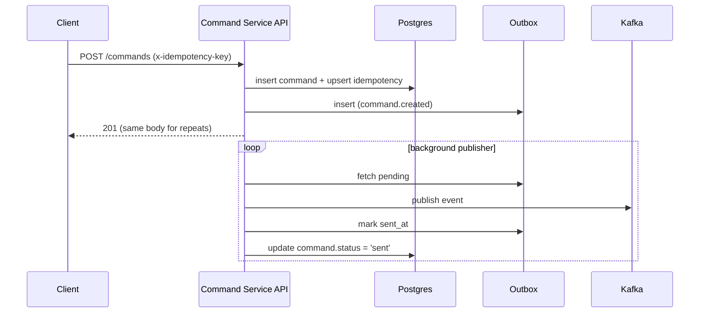
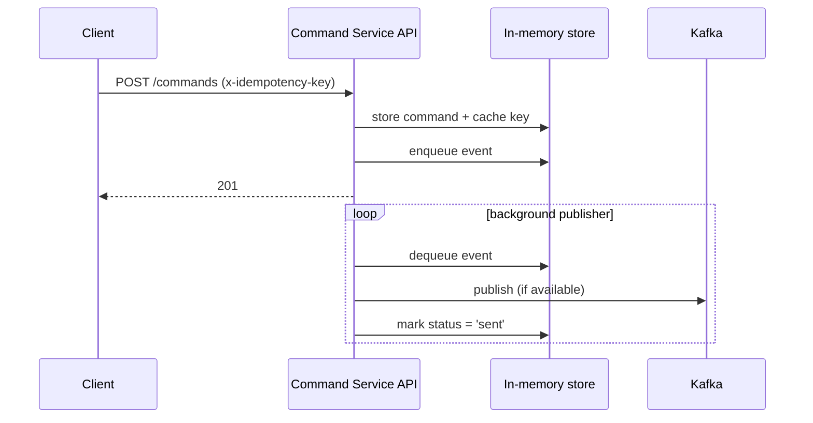

# Idempotency in Command Service

- Endpoint: `POST /commands`
- Header: `x-idempotency-key: <opaque-string>`

## Behavior

- On first request with a given key:
  - A new command is created (`status=queued`), an outbox event enqueued,
    and the key is recorded.
- On subsequent requests with the same key:
  - The original command is returned (same `id`).

## Storage Modes

- DB mode (Postgres available): keys stored in `idempotency(key, command_id, created_at)`.
- In-memory fallback (no DB): keys cached in-process
  (non-durable; for dev/tests only).

## Flows (Sequence)

DB mode:



In-memory mode:



## Retry Guidance (Clients)

- Reuse the same `x-idempotency-key` for all retries of the same action.
- On 5xx or timeouts, retry with exponential backoff
  (e.g., 250ms, 500ms, 1s, 2s, 4s; max N tries).
- Treat 201 responses as success even if previous attempt outcome was unknown.

## Responses

- 201 Created with body of the command (same response for first and repeated call).
- Errors: standard FastAPI validation / 500 on server issues.

## Expiration and Scope

- Keys are treated as opaque and currently do not expire in DB mode (M0).
  Add TTL/cleanup in later milestones.
- Scope: global per service.

## Recommendations for Clients

- Generate a unique key per natural "create command" action.
- Retries should reuse the same key.
- Use a high-entropy value (UUID v4 or ULID).

## Example

```http
POST /commands HTTP/1.1
Host: command-service
Content-Type: application/json
x-idempotency-key: 796f0a7d-7f1d-4b0f-8a47-3b0b0c1a4e1e

{"device_id":"dev-xyz","name":"reboot","payload":{"force":true}}
```
